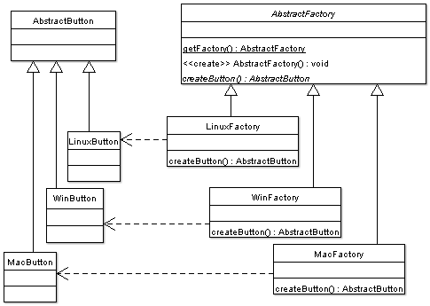

# Abstract factory pattern


## 维基百科[Abstract factory pattern](https://en.wikipedia.org/wiki/Abstract_factory_pattern)

> NOTE: 建议先阅读例子，然后阅读理论描述

### [Structure](https://en.wikipedia.org/wiki/Abstract_factory_pattern#Structure)


[](https://en.wikipedia.org/wiki/File:Abstract_factory.svg)

**Class diagram example** The method `createButton` on the `GUIFactory` interface returns objects of type `Button`. What implementation of `Button` is returned depends on which implementation of `GUIFactory` is handling the method call.

> NOTE: UML图最能够体现abstract factory pattern


### [Python](https://en.wikipedia.org/wiki/Python_(programming_language)) example

```python
from abc import ABC, abstractmethod
from sys import platform


class Button(ABC):

    @abstractmethod
    def paint(self):
        pass


class LinuxButton(Button):

    def paint(self):
        return 'Render a button in a Linux style'


class WindowsButton(Button):

    def paint(self):
        return 'Render a button in a Windows style'


class MacOSButton(Button):

    def paint(self):
        return 'Render a button in a MacOS style'


class GUIFactory(ABC):

    @abstractmethod
    def create_button(self):
        pass


class LinuxFactory(GUIFactory):

    def create_button(self):
        return LinuxButton()


class WindowsFactory(GUIFactory):

    def create_button(self):
        return WindowsButton()


class MacOSFactory(GUIFactory):

    def create_button(self):
        return MacOSButton()

def GetFactory():
    if platform == 'linux':
        factory = LinuxFactory()
    elif platform == 'darwin':
        factory = MacOSFactory()
    elif platform == 'win32':
        factory = WindowsFactory()
    else:
        raise NotImplementedError(
            'Not implemented for your platform: {}'.format(platform)
        )
    return factory
if __name__ == '__main__':
    factory = GetFactory()
    button = factory.create_button()
    result = button.paint()
    print(result)
```

Alternative implementation using the classes themselves as factories:

```python
from abc import ABC, abstractmethod
from sys import platform


class Button(ABC):

    @abstractmethod
    def paint(self):
        pass


class LinuxButton(Button):
    def paint(self):
        return 'Render a button in a Linux style'


class WindowsButton(Button):

    def paint(self):
        return 'Render a button in a Windows style'


class MacOSButton(Button):

    def paint(self):
        return 'Render a button in a MacOS style'

def GetFactory():
    if platform == "linux":
        factory = LinuxButton
    elif platform == "darwin":
        factory = MacOSButton
    elif platform == "win32":
        factory = WindowsButton
    else:
        raise NotImplementedError(
            'Not implemented for your platform: {}'.format(platform)
        )

if __name__ == '__main__':
    factory = GetFactory()
    button = factory.create_button()
    result = button.paint()
    print(result)
```

> NOTE: Everything in python is a object，so do class
>
> 下面是上述代码的UML图
>
> 