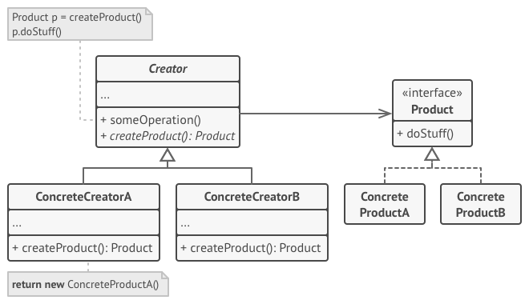
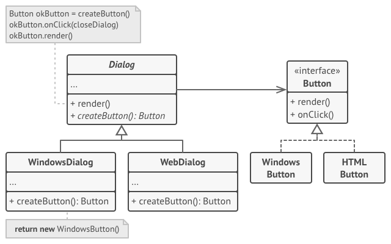

# Factory method pattern

## refactoring [Factory Method](https://refactoring.guru/design-patterns/factory-method)

### Problem

> NOTE: 
>
> logistics management application 后勤管理系统
>
> truck 卡车
>
> 原文所举的例子容易理解

As a result, you will end up with pretty nasty code, riddled（充斥） with conditionals that switch the app’s behavior depending on the class of transportation objects.

> NOTE: 在`Theory\Design-pattern\OOP-design-pattern\Summary-of-design-pattern.md`中，已经总结了“Design pattern让我们避免使用if-else分支”。

### Solution

Subclasses can alter the class of objects being returned by the factory method.

There’s a slight limitation though: subclasses may return different types of products only if these products have a common base class or interface. Also, the factory method in the base class should have its return type declared as this interface.

All products must follow the same interface.

### Structure

### Pseudocode

### Applicability

## 维基百科[Factory method pattern](https://en.wikipedia.org/wiki/Factory_method_pattern)