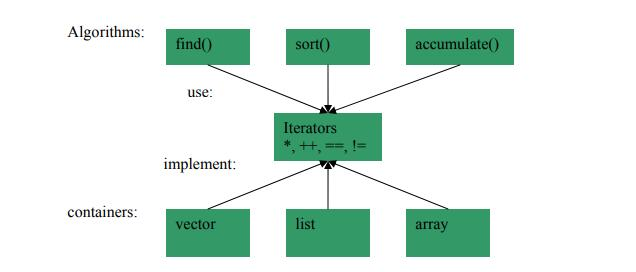

# Generic programming

如何使代码更加地generic，即更加地通用？这是所有的programming language都需要考虑的一个问题，`c++`中通过template来实现generic，python中的duck type也能够使程序更加地generic，需要注意的是，严格说来，这里所说的generic并不是本文接下来要讨论的generic programming。我是在思考“如何使代码更加地generic”而想到generic programming的。[Generic programming](https://en.wikipedia.org/wiki/Generic_programming)的核心思想是：

> 抽象出类型并使用concept进行formal description，algorithm/function基于concept来进行设计和实现，从而达到使程序更加地generic的目的。

更多细节将再下面这篇文章中介绍。

## wikipedia [Generic programming](https://en.wikipedia.org/wiki/Generic_programming)

**Generic programming** is a style of [computer programming](https://en.wikipedia.org/wiki/Computer_programming) in which [algorithms](https://en.wikipedia.org/wiki/Algorithm) are written in terms of [types](https://en.wikipedia.org/wiki/Data_type) *to-be-specified-later* that are then *instantiated* when needed for specific types provided as [parameters](https://en.wikipedia.org/wiki/Parameter_(computer_programming)). 

> NOTE: C++ 的template就是典型的案例；上述描述让我想到了symbol。

This approach, pioneered by [ML](https://en.wikipedia.org/wiki/ML_(programming_language)) in 1973,[[1\]](https://en.wikipedia.org/wiki/Generic_programming#cite_note-Lee2008-1)[[2\]](https://en.wikipedia.org/wiki/Generic_programming#cite_note-2) permits writing common [functions](https://en.wikipedia.org/wiki/Function_(computer_science)) or [types](https://en.wikipedia.org/wiki/Type_(computer_science)) that differ only in the set of types on which they operate when used, thus reducing [duplication](https://en.wikipedia.org/wiki/Duplicate_code). 

> NOTE: 显然，generic programming 能够保证 [code reuse](http://en.wikipedia.org/wiki/Code_reuse)。

Such software entities are known as 

1) *generics* in [Python](https://en.wikipedia.org/wiki/Python_(programming_language)), [Ada](https://en.wikipedia.org/wiki/Ada_(programming_language)), [C#](https://en.wikipedia.org/wiki/C_Sharp_(programming_language)), [Delphi](https://en.wikipedia.org/wiki/Delphi_(programming_language)), [Eiffel](https://en.wikipedia.org/wiki/Eiffel_(programming_language)), [F#](https://en.wikipedia.org/wiki/F_Sharp_(programming_language)), [Java](https://en.wikipedia.org/wiki/Java_(programming_language)), [Rust](https://en.wikipedia.org/wiki/Rust_(programming_language)), [Swift](https://en.wikipedia.org/wiki/Swift_(programming_language)), [TypeScript](https://en.wikipedia.org/wiki/TypeScript) and [Visual Basic .NET](https://en.wikipedia.org/wiki/Visual_Basic_.NET). 

2) They are known as *[parametric polymorphism](https://en.wikipedia.org/wiki/Parametric_polymorphism)* in [ML](https://en.wikipedia.org/wiki/ML_(programming_language)), [Scala](https://en.wikipedia.org/wiki/Scala_(programming_language)), [Julia](https://en.wikipedia.org/wiki/Julia_(programming_language)), and [Haskell](https://en.wikipedia.org/wiki/Haskell_(programming_language)) (the Haskell community also uses the term "generic" for a related but somewhat different concept); 

3) *[templates](https://en.wikipedia.org/wiki/Template_(C%2B%2B))* in [C++](https://en.wikipedia.org/wiki/C%2B%2B) and [D](https://en.wikipedia.org/wiki/D_(programming_language)); 

4) *parameterized types* in the influential 1994 book *[Design Patterns](https://en.wikipedia.org/wiki/Design_Patterns_(book))*.[[3\]](https://en.wikipedia.org/wiki/Generic_programming#cite_note-GoF-3)

> NOTE: "parameterized type" 的意思是: 参数化类型，"the influential 1994 book *[Design Patterns](https://en.wikipedia.org/wiki/Design_Patterns_(book))*"，在 `Theory\Programming-paradigm\Object-oriented-programming\Design-pattern\Principle` 章节中进行了引用。

> NOTE: 通过上面四段话，我们可以看到，同一个概念在不同的领域有着不同的名称，其实它们表达了相同的内涵。

The term "generic programming" was originally coined by [David Musser](https://en.wikipedia.org/wiki/David_Musser) and [Alexander Stepanov](https://en.wikipedia.org/wiki/Alexander_Stepanov)[[4\]](https://en.wikipedia.org/wiki/Generic_programming#cite_note-FOOTNOTEMusserStepanov1989-4) in a more specific sense than the above, to describe a programming paradigm whereby **fundamental requirements on types** are **abstracted** from across concrete examples of algorithms and data structures and formalized as [concepts](https://en.wikipedia.org/wiki/Concept_(generic_programming)), with [generic functions](https://en.wikipedia.org/wiki/Generic_function) implemented in terms of these concepts, typically using language genericity mechanisms as described above.

> NOTE: 这段话更加具体地阐述了generic programming的思想：从具体的algorithm、data structure中**抽象**出对type的fundamental requirement，然后使用形式化的[concept](https://en.wikipedia.org/wiki/Concept_(generic_programming))来进行描述， [generic functions](https://en.wikipedia.org/wiki/Generic_function) 的实现是基于这些concept的。关于concept，在`./Concept(generic-programming)`中进行了描述。
>
> [C++20 concept特性](https://en.wikipedia.org/wiki/Concepts_(C++))是对上面这一段中描述的[concept](https://en.wikipedia.org/wiki/Concept_(generic_programming))的实现。
>
> 关于抽象，参见:
>
> 1) 文章abstraction
>
> 2) `Theory\Programming-paradigm\Abstraction`
>
> 显然，abstraction带来了Generic 。

### [Stepanov–Musser and other generic programming paradigms](https://en.wikipedia.org/wiki/Generic_programming#Stepanov%E2%80%93Musser_and_other_generic_programming_paradigms)

> Generic programming centers around the idea of abstracting from concrete, efficient algorithms to obtain generic algorithms that can be combined with different data representations to produce a wide variety of useful software.
>
> — Musser, David R.; Stepanov, Alexander A., Generic Programming[[5\]](https://en.wikipedia.org/wiki/Generic_programming#cite_note-5)

> NOTE: 上面这段话描述的是generic programming的思想。

the best known example is the [Standard Template Library](https://en.wikipedia.org/wiki/Standard_Template_Library) (STL),[[8\]](https://en.wikipedia.org/wiki/Generic_programming#cite_note-8)[[9\]](https://en.wikipedia.org/wiki/Generic_programming#cite_note-9) which developed a theory of [iterators](https://en.wikipedia.org/wiki/Iterator) that is used to decouple sequence data structures and the algorithms operating on them.

...Thus, only *N* + *M* data structure-algorithm combinations need be implemented....

> NOTE: 原文的这一段分析，使用量化的方式（从*N* × *M* 到 *N* + *M* ）来为我们分析了generic programming所创造的genericity 的价值。
>
> 原文的上述两段中，都提及了iterator，我觉得它是对data structure的抽象描述，正如AST是对program的抽象描述（在compiler principle工程中有描述），它们可以看做是一种protocol，这种protocol实现了generic programming中多个不同的component之间的interact，比如algorithm和data structure之间通过iterator来进行interact，显然通过它们，多个不同的component之间可以进行组合，显然，通过它们，我们使用*N* + *M* 来实现*N* × *M* 。关于此的分析，在工程龙书的[Chapter-6-Intermediate-Code-Generation](https://dengking.github.io/compiler-principle/Chapter-6-Intermediate-Code-Generation/)中也有相同的分析。Stroustrup的文章[C++ in 2005](http://www.stroustrup.com/DnE2005.pdf) 中的的这张图直观地体现了
>
> 
>
> 如何来创造适合于具体问题的抽象描述/protocol，这是至关重要的问题。
>
> 上面的分析，其实验证了在软件工程设计中经常使用到的一个说法：依赖于抽象而不是依赖于具体，抽象描述/protocol就是抽象，各个component之间应该依赖于它们。
>
> 在进行software design的时候，我们常常在讨论的一个话题是：decouple，显然generic programming是实现decouple的一种途径，最最典型的例子就是：generic programming显然能够decouple  algorithm和data structure。从上述对generic programming所实现的从*N* + *M* 到 *N* × *M*，我们能看到loosely coupled的价值所在。

Generic programming similarly has been applied in other domains, e.g. graph algorithms.[[10\]](https://en.wikipedia.org/wiki/Generic_programming#cite_note-10)

> NOTE: [[10\]](https://en.wikipedia.org/wiki/Generic_programming#cite_note-10)所引用的是[The Boost Graph Library (BGL)](https://www.boost.org/doc/libs/1_73_0/libs/graph/doc/)，它的文档中也谈及了generic programming。

> Generic programming is about abstracting and classifying **algorithms** and **data structures**. It gets its inspiration from Knuth and not from type theory. Its goal is the incremental construction of systematic catalogs of useful, efficient and abstract algorithms and data structures. Such an undertaking is still a dream.
>
> — Alexander Stepanov, Short History of STL [[11\]](https://en.wikipedia.org/wiki/Generic_programming#cite_note-11)[[12\]](https://en.wikipedia.org/wiki/Generic_programming#cite_note-stroustrup2007-12)

> I believe that iterator theories are as central to Computer Science as theories of [rings](https://en.wikipedia.org/wiki/Ring_(mathematics)) or [Banach spaces](https://en.wikipedia.org/wiki/Banach_space) are central to Mathematics.
>
> — Alexander Stepanov, An Interview with A. Stepanov[[13\]](https://en.wikipedia.org/wiki/Generic_programming#cite_note-stepanov2011-13)

> Following Stepanov, we can define generic programming without mentioning language features: Lift algorithms and data structures from concrete examples to their most general and abstract form.
>
> — Bjarne Stroustrup, Evolving a language in and for the real world: C++ 1991-2006[[12\]](https://en.wikipedia.org/wiki/Generic_programming#cite_note-stroustrup2007-12)

> NOTE: 上面这些专家们对generic programming的分析是结合了STL的实现来展开的：algorithm、iterator、data structure，构成了STL，这个最最著名的generic  programming的实现。
>
> 但是我们不能够将我们的眼光仅仅局限于STL。

In this article we distinguish the high-level [programming paradigms](https://en.wikipedia.org/wiki/Programming_paradigm) of *generic programming*, above, from the lower-level programming language *genericity mechanisms* used to implement them (see [Programming language support for genericity](https://en.wikipedia.org/wiki/Generic_programming#Programming_language_support_for_genericity)).

> NOTE: 这段话印证了在本章开篇[Programming-paradigm](../Programming-paradigm.md)中所论述的观点，上面这段话中的“high-level [programming paradigms](https://en.wikipedia.org/wiki/Programming_paradigm) of *generic programming*”所指的是generic programming的核心思想，“lower-level programming language *genericity mechanisms* used to implement them”则指的是programming language的实现。

### Programming language support for genericity

#### Generics in Ada

#### Templates in C++

*Main article:* [Template (C++)](https://en.wikipedia.org/wiki/Template_(C%2B%2B))

C++ uses templates to enable generic programming techniques. The C++ Standard Library includes the [Standard Template Library](https://en.wikipedia.org/wiki/Standard_Template_Library) or STL that provides a framework of templates for common data structures and algorithms. Templates in C++ may also be used for [template metaprogramming](https://en.wikipedia.org/wiki/Template_metaprogramming), which is a way of pre-evaluating some of the code at compile-time rather than [run-time](https://en.wikipedia.org/wiki/Run_time_(program_lifecycle_phase)). Using template specialization, C++ Templates are considered [Turing complete](https://en.wikipedia.org/wiki/Turing_complete).

> NOTE: 上述对C++ template的总结是非常好的

#### Generics in Java

*Main article:* [Generics in Java](https://en.wikipedia.org/wiki/Generics_in_Java)

#### Genericity in .NET [C#, VB.NET]

## Implementation of generic programming

在`./Implementation`中，讨论了C++、Python、Java/`C#`实现generic programming的方式；

## Generic programming and reusable code 

在维基百科[Generic programming](https://en.wikipedia.org/wiki/Generic_programming)的第一段中就表达了该观点：

>  reducing [duplication](https://en.wikipedia.org/wiki/Duplicate_code) 

在 drdobbs [C++ Type Traits](https://www.drdobbs.com/cpp/c-type-traits/184404270) 中有这样的描述：

> Generic programming -- that is, writing code that works with any data type meeting a set of **requirements** -- has become the method of choice for delivering reusable code. 

这段话提示我们：generic programming是实现reusable code的一种方法

## Example of generic programming

### C++

#### [Standard Template Library](https://en.wikipedia.org/wiki/Standard_Template_Library)

#### [The Boost Graph Library (BGL)](https://www.boost.org/doc/libs/1_73_0/libs/graph/doc/)