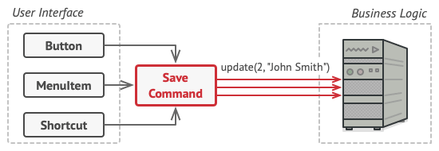

# Command pattern

1、是在阅读 refactoring.guru [Visitor](https://refactoring.guru/design-patterns/visitor) 时，其中有这样的描述:

> You can treat [Visitor](https://refactoring.guru/design-patterns/visitor) as a powerful version of the [Command](https://refactoring.guru/design-patterns/command) pattern. Its objects can execute operations over various objects of different classes.

上面这段话中的"its"所指的是visitor。

2、我当前没有使用过command pattern，但是使用过"Active-object pattern"，在stackoverflow [Explain “Active-object” pattern](https://stackoverflow.com/questions/41676343/explain-active-object-pattern) # comments中有这样的描述: 

> Active-object is the [Command Pattern](https://sourcemaking.com/design_patterns/command), implemented concurrently.

因此结合Active-object patter能够有助于了解command pattern。

3、command是一个非常好的抽象，它是横切关注点，command pattern其实运用了AOP。

command 和 message/event-driven model 中的 message/event 非常类似，它的另外一个同义词是 "request"。

## refactoring.guru [Command](https://refactoring.guru/design-patterns/command)

### Intent

**Command** is a **behavioral design pattern** that turns a request into a stand-alone object that contains all information about the request. This transformation lets you parameterize methods with different requests, delay or queue a request’s execution, and support undoable(可撤销的) operations.

### Problem

### Solution

Good software design is often based on the *principle of separation of concerns*, which usually results in breaking an app into layers. The most common example: a layer for the graphical user interface and another layer for the business logic. The GUI layer is responsible for rendering a beautiful picture on the screen, capturing any input and showing results of what the user and the app are doing. However, when it comes to doing something important, like calculating the trajectory(轨道) of the moon or composing an annual report, the GUI layer delegates the work to the underlying layer of **business logic**.

> NOTE: 每一layer，就是一个cross-cutting concern，关于此，参见 `Theory\Programming-paradigm\Aspect-oriented-programming` 。Command pattern中的command object就是两层之间的**通讯协议**，在后面会对此进行说明。

In the code it might look like this: a GUI object calls a method of a business logic object, passing it some arguments. This process is usually described as one object sending another a *request*.

*The GUI objects may access the business logic objects directly.*

#### *Command* class and object

The **Command pattern** suggests that GUI objects shouldn’t send these requests directly. Instead, you should extract all of the request details, such as the object being called, the name of the method and the list of arguments into a separate *command* class with a single method that triggers this request.

**Command objects** serve as **links** between various GUI and business logic objects. From now on, the GUI object doesn’t need to know what business logic object will receive the request and how it’ll be processed. The GUI object just triggers the command, which handles all the details.

*Accessing the business logic layer via a command.*

The next step is to make your commands implement the same **interface**. Usually it has just a single execution method that takes no parameters. This **interface** lets you use various commands with the same request sender, without coupling it to concrete classes of commands. As a bonus, now you can switch command objects linked to the sender, effectively changing the sender’s behavior at runtime.

You might have noticed one missing piece of the puzzle, which is the request parameters. A GUI object might have supplied the **business-layer object** with some parameters. Since the **command execution method** doesn’t have any parameters, how would we pass the request details to the receiver? It turns out the command should be either pre-configured with this data, or capable of getting it on its own.

#### Apply Command pattern

Let’s get back to our text editor. After we apply the **Command pattern**, we no longer need all those button subclasses to implement various click behaviors. It’s enough to put a single field into the base `Button` class that stores a reference to a **command object** and make the button execute that command on a click.

You’ll implement a bunch of **command classes** for every possible operation and link them with particular **buttons**, depending on the buttons’ intended behavior.

Other GUI elements, such as menus, shortcuts or entire dialogs, can be implemented in the same way. They’ll be linked to a command which gets executed when a user interacts with the GUI element. As you’ve probably guessed by now, the elements related to the same operations will be linked to the same **commands**, preventing any code duplication.

As a result, commands become a convenient **middle layer** that reduces coupling between the **GUI** and **business logic layers**. And that’s only a fraction of the benefits that the **Command pattern** can offer!

### Real-World Analogy

