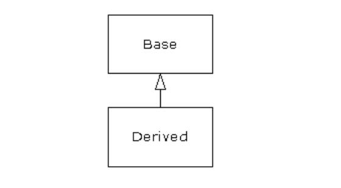
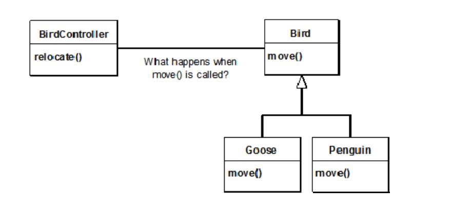

# Introduction to Objects

“We cut nature up, organize it into **concepts**, and ascribe significances as we do, largely because we are parties to an agreement that holds throughout our speech community and is codified in the patterns of
our language … we cannot talk at all except by subscribing to the organization and classification of data which the agreement decrees.” Benjamin Lee Whorf (1897-1941)

> NOTE: 我们之所以将自然分解，组织成各种概念，并按其含义分类，主要是我们是整个口语交流社会共同遵守的协定的参与者，这个协定以语言的形式固定下来...除非赞成这个这个协定中有关语言的组织和分类，否则我们无法交谈。

The genesis（起源） of the computer revolution was in a **machine**. The genesis of our programming languages thus tends to look like that machine.

> NOTE: “The genesis of our programming languages thus tends to look like that machine”的意思是：起初的programming language是非常类似于machine的。作者此处所表达的意思，早期的programming language主要是为了“描述”machine。关于“描述”参见文章[Language](https://dengking.github.io/Post/Language/Language/)。

But computers are not so much machines as they are mind amplification（放大） tools (“bicycles for the mind,” as Steve Jobs is fond of saying) and a different kind of **expressive medium**. As a result, the tools are beginning to look less like machines and more like parts of our **minds**, and also like other forms of **expression** such as writing, painting, sculpture, animation, and filmmaking. **[Object-oriented programming](https://en.wikipedia.org/wiki/Object-oriented_programming)** (OOP) is part of this movement toward using the computer as an **expressive medium**.

> NOTE: 上面这段表达的意思是programming language的发展趋势是“描述” mind。显然OOP就是在这种浪潮下诞生的。
>
> 关于programming language，参见文章[Abstraction](https://dengking.github.io/Post/Abstraction/Abstraction/)的[Abstraction in programming language](https://dengking.github.io/Post/Abstraction/Abstraction/#abstraction-in-programming-language)章节。

This chapter will introduce you to the basic concepts of OOP, including an overview of development methods. 

This chapter is background and supplementary material. Many people do not feel comfortable wading into object-oriented programming without understanding the big picture first. Thus, there are many concepts that are introduced here to give you a solid overview of OOP. However, other people may not get the big picture concepts until they’ve seen some of the mechanics first; these people may become bogged down and lost without some code to get their hands on. If you’re part of this latter group and are eager to get to the specifics of the language, feel free to jump past this chapter—skipping it at this point will not prevent you from writing programs or learning the language. However, you will want to come back here eventually to fill in your knowledge so you can understand why objects are important and how to design with them.

## The progress of abstraction

> NOTE: 本节主要描述OO思想。

All programming languages provide **abstractions**. It can be argued that the complexity of the problems you’re able to solve is directly related to the **kind** and **quality** of abstraction. By “kind” I mean, “What is it that you are abstracting?” **Assembly language** is a small abstraction of the underlying machine. Many so-called “imperative” languages that followed (such as FORTRAN, BASIC, and C) were **abstractions** of **assembly language**. These languages are big improvements over assembly language, but their primary abstraction still requires you to think in terms of the structure of the computer rather than the structure of the problem you are trying to solve（也就是说，它们还不够抽象，还是太底层了）. The programmer must establish the association between the machine model (in the “**solution space**,” which is the place where you’re implementing that solution, such as a computer) and the model of the problem that is actually being solved (in the “**problem space**,” which is the place where the problem exists, such as a business). The effort required to perform this mapping, and the fact that it is extrinsic（非固有的） to the programming language, produces programs that are difficult to write and expensive to maintain, and as a side effect created the entire “programming methods” industry.

> NOTE: “programming methods”的意思是“程序设计方法学”

The alternative to modeling the machine is to model the problem you’re trying to solve. Early languages such as [LISP](https://en.wikipedia.org/wiki/Lisp_(programming_language)) and [APL](https://en.wikipedia.org/wiki/APL_(programming_language)) chose particular views of the world (“All problems are ultimately lists” or “All problems are algorithmic,” respectively). [Prolog](https://en.wikipedia.org/wiki/Prolog) casts all problems into chains of decisions. Languages have been created for constraint-based programming and for programming exclusively by manipulating graphical symbols. (The latter proved to be too restrictive.) Each of these approaches may be a good solution to the particular class of problem they’re designed to solve, but when you step outside of that domain they become awkward.

The object-oriented approach goes a step further by providing tools for the programmer to represent elements in the **problem space**. This representation is general enough that the programmer is not constrained to any particular type of problem. We refer to the **elements** in the **problem space** and their representations in the **solution space** as “**objects**.” (You will also need other **objects** that don’t have problem-space analogs.) The idea is that the program is allowed to adapt itself to the lingo（术语） of the problem by adding new **types** of **objects**, so when you read the code describing the **solution**, you’re reading words that also express the **problem**. This is a more flexible and powerful language **abstraction** than what we’ve had before. Thus, OOP allows you to describe the problem in terms of the problem, rather than in terms of the computer where the solution will run. There’s still a connection back to the computer: Each **object** looks quite a bit like a little **computer**—it has a **state**, and it has operations that you can ask it to perform. However, this doesn’t seem like such a bad analogy to objects in the real world—they all have characteristics and behaviors.

> NOTE: 上面这段话描述了OO的思想，优势。我觉得OO的核心思想就是使用class来描述problem space中的各种抽象概念，然后对问题进行建模，进行实现。OO的优势在于：
>
> - OO更加抽象，更加expressive
>
> - OO是general的，而不是specific的
>
> 关于abstraction，参见文章[Abstraction](https://dengking.github.io/Post/Abstraction/Abstraction/)，其中[Abstraction in programming language](https://dengking.github.io/Post/Abstraction/Abstraction/#abstraction-in-programming-language)章节，讨论了programming language的发展简史。
>
> 上面这段话中的“Each **object** looks quite a bit like a little **computer**”所表达的思想和下面“An object provides services”小节中表达的思想类似。

Alan Kay summarized five basic characteristics of [Smalltalk](https://en.wikipedia.org/wiki/Smalltalk), the first successful object-oriented language and one of the languages upon which [Java](https://en.wikipedia.org/wiki/Java_(programming_language)) is based. These characteristics represent a pure approach to **object-oriented programming**:

1. **Everything is an [object](https://en.wikipedia.org/wiki/Object_(computer_science))**. Think of an object as a fancy **variable**; it stores data, but you can “make requests” to that object, asking it to perform operations on itself. In theory, you can take any **conceptual component** in the problem you’re trying to solve (dogs, buildings, services, etc.) and represent it as an object in your program.

2. **A program is a bunch of objects telling each other what to do by sending messages. To make a request of an object, you “send a message” to that object**. More concretely, you can think of a message as a request to call a method that belongs to a particular object.

  > NOTE: 上面这段话总结从OOP的角度来描述程序的运行。
  >
  > 牢记“send a message”和"make a request“，后面会频繁出现，在下一节会描述如何来实现“send a message”。

3. **Each object has its own memory made up of other objects**. Put another way, you create a new kind of object by making a package containing existing objects. Thus, you can build complexity into a program while hiding it behind the simplicity of objects.

   > NOTE: 这就是我们常常所说的[Object composition](https://en.wikipedia.org/wiki/Object_composition)

4. **Every object has a type**. Using the parlance, each object is an ***[instance](https://en.wikipedia.org/wiki/Instance_(computer_science))*** of a ***[class](https://en.wikipedia.org/wiki/Class_(computer_programming))***, in which “class” is synonymous with “type.” The most important distinguishing characteristic of a class is “What messages can you send to it?”

5. **All objects of a particular type can receive the same messages**. This is actually a loaded statement, as you will see later. Because an object of type “circle” is also an object of type “shape,” a circle is guaranteed to accept shape messages. This means you can write code that talks to shapes and automatically handle anything that fits the description of a shape. This **[substitutability](https://en.wikipedia.org/wiki/Liskov_substitution_principle)** is one of the powerful concepts in OOP.

> NOTE: 上面5条对OOP的总结非常好。

Booch offers an even more succinct description of an object:

> An object has state, behavior and identity.

This means that an **object** can have **internal data** (which gives it state), **methods** (to produce behavior), and each object can be uniquely distinguished from every other object—to put this in a concrete sense, each object has a unique address in memory. 

> ATTENTION: This is actually a bit restrictive, since objects can conceivably exist in different machines and address spaces, and they can also be stored on disk. In these cases, the identity of the object must be determined by something other than memory address.

## An object has an interface

> NOTE: 本节主要分析的是object和class之间的关系、class和type之间的关系、如何来实现“sent a message”。

Aristotle（亚里士多德） was probably the first to begin a careful study of the concept of **type**; he spoke of “the class of fishes and the class of birds.” The idea that all objects, while being unique, are also part of a **class** of **objects** that have characteristics and behaviors in common was used directly in the first object-oriented language, [Simula-67](https://en.wikipedia.org/wiki/Simula), with its fundamental keyword `class` that introduces a new type into a program.

Simula, as its name implies, was created for developing simulations such as the classic “bank teller problem.” In this, you have numerous tellers, customers, accounts, transactions, and units of money—a lot of “objects.” Objects that are identical except for their state during a program’s execution are grouped together into “classes of objects,” and that’s where the keyword `class` came from. Creating **abstract data types** (classes) is a fundamental concept in **object-oriented programming**. **[Abstract data types](http://en.wikipedia.org/wiki/Abstract_data_type)** work almost exactly like built-in types: You can create variables of a type (called **objects** or **instances** in object-oriented parlance) and manipulate those variables (called **sending messages** or **requests**; you send a message and the object figures out what to do with it). The members (elements) of each class share some commonality: Every account has a balance, every teller can accept a deposit, etc. At the same time, each member has its own state: Each account has a different balance, each teller has a name. Thus, the tellers, customers, accounts, transactions, etc., can each be represented with a unique entity in the computer program. This entity is the object, and each object belongs to a particular class that defines its characteristics and behaviors.

So, although what we really do in object-oriented programming is create new **data types**, virtually all object-oriented programming languages use the “class” keyword. When you see the word “**type**” think “**class**” and vice versa. 

> ATTENTION: Some people make a distinction, stating that type determines the interface while class is a particular implementation of that interface. 

Since a **class** describes a set of **objects** that have identical characteristics (data elements) and behaviors (functionality), a class is really a **data type** because a floating point number, for example, also has a set of characteristics and behaviors. The difference is that a programmer defines a **class** to fit a problem rather than being forced to use an existing data type that was designed to represent a unit of storage in a machine. You extend the programming language by adding new data types specific to your needs. The programming system welcomes the new classes and gives them all the care and type checking that it gives to built-in types.

The object-oriented approach is not limited to building simulations. Whether or not you agree that any program is a simulation of the system you’re designing, the use of OOP techniques can easily reduce a large set of problems to a simple solution.

Once a **class** is established, you can make as many objects of that class as you like, and then manipulate those objects as if they are the elements that exist in the problem you are trying to solve. Indeed, one of the challenges of object-oriented programming is to create a one-to-one mapping between the elements in the **problem space** and objects in the **solution space**.

> NOTE: OOP的challenge。

But how do you get an object to do useful work for you? There needs to be a way to **make a request** of the object so that it will do something, such as complete a transaction, draw something on the screen, or turn on a switch. And each object can satisfy only certain requests. The requests you can make of an object are defined by its *[interface](https://en.wikipedia.org/wiki/Interface_(computing))*, and the type is what determines the interface. A simple example might be a representation of a light bulb:


The interface determines the requests that you can make for a particular object. However, there must be code somewhere to satisfy that request. This, along with the **hidden data**, comprises the *[implementation](https://en.wikipedia.org/wiki/Implementation#Computer_science)*. From a procedural programming standpoint, it’s not that complicated. A type has a method associated with each possible request, and when you make a particular request to an object, that method is called. This process is usually summarized by saying that you “**send a message**” (**make a request**) to an object, and the object figures out what to do with that message (it executes code).

The preceding diagram follows the format of the *[Unified Modeling Language](https://en.wikipedia.org/wiki/Unified_Modeling_Language)* (UML). Each class is represented by a box, with the **type name** in the top portion of the box, any **data members** that you care to describe in the middle portion of the box, and the **methods** (the functions that belong to this object, which receive any messages you send to that object) in the bottom portion of the box. Often, only the name of the class and the public methods are shown in UML design diagrams, so the middle portion is not shown, as in this case. If you’re interested only in the class name, then the bottom portion doesn’t need to be shown, either.


## An object provides services

> NOTE: 本节主要讲述了如何来更好地使用OO来解决问题，秉持：将object理解为“service provider”的思想。

While you’re trying to develop or understand a program design, one of the best ways to think about **objects** is as “**service providers**.” Your program itself will provide services to the user, and it will accomplish this by using the services offered by other objects. Your goal is to produce (or even better, locate in existing code libraries) a set of objects that provide the ideal services to solve your problem.

Thinking of an object as a **service provider** has an additional benefit: It helps to improve the cohesiveness of the object. [High cohesion](https://en.wikipedia.org/wiki/Cohesion_(computer_science)) is a fundamental quality of software design: It means that the various aspects of a **software component** (such as an object, although this could also apply to a method or a library of objects) “fit together” well. One problem people have when designing objects is cramming（塞进） too much functionality into one object. For example, in your check printing module, you may decide you need an object that knows all about formatting and printing. You’ll probably discover that this is too much for one object, and that what you need is three or more objects. One object might be a catalog of all the possible check layouts, which can be queried for information about how to print a check. One object or set of objects can be a generic printing interface that knows all about different kinds of printers (but nothing about bookkeeping—this one is a candidate for buying rather than writing yourself). And a third object could use the services of the other two to accomplish the task. Thus, each object has a cohesive set of services it offers. In a good object-oriented design, each object does one thing well, but doesn’t try to do too much. This not only allows the discovery of objects that might be purchased (the printer interface object), but it also produces new objects that might be reused somewhere else (the catalog of check layouts).

Treating objects as service providers is a great simplifying tool. This is useful not only during the design process, but also when someone else is trying to understand your code or reuse an object. If they can see the value of the object based on what service it provides, it makes it much easier to fit it into the design.

## The hidden implementation

It is helpful to break up the playing field into ***class*** creators (those who create new data types) and ***client programmers*** (the class consumers who use the data types in their applications). The goal of the **client programmer** is to collect a toolbox full of classes to use for rapid application development. The goal of the **class creator** is to build a class that exposes only what’s necessary to the **client programmer** and keeps everything else **hidden**. Why? Because if it’s hidden, the client programmer can’t access it, which means that the class creator can change the hidden portion at will without worrying about the impact on anyone else. The hidden portion usually represents the tender insides of an object that could easily be corrupted by a careless or uninformed client programmer, so hiding the implementation reduces program bugs.

> NOTE: 上面这段所描述的是使用OOP带来的一个好处：hidden。

In any relationship it’s important to have **boundaries** that are respected by all parties involved. When you create a library, you establish a relationship with the client programmer, who is also a programmer, but one who is putting together an application by using your library, possibly to build a bigger library. If all the members of a class are available to everyone, then the client programmer can do anything with that class and there’s no way to enforce rules. Even though you might really prefer that the client programmer not directly manipulate some of the members of your class, without **access control** there’s no way to prevent it. Everything’s naked to the world.

So the first reason for **access control** is to keep client programmers’ hands off portions they shouldn’t touch—parts that are necessary for the internal operation of the data type but not part of the interface that users need in order to solve their particular problems. This is actually a service to client programmers because they can easily see what’s important to them and what they can ignore.

The second reason for access control is to allow the library designer to change the internal workings of the class without worrying about how it will affect the client programmer. For example, you might implement a particular class in a simple fashion to ease development, and then later discover that you need to rewrite it in order to make it run faster. If the interface and implementation are clearly separated and protected, you can accomplish this easily.

Java uses three explicit keywords to set the boundaries in a class: public, private, and protected. These access specifiers determine who can use the definitions that follow. public means the following element is available to everyone. The private keyword, on the other hand, means that no one can access that element except you, the creator of the type, inside methods of that type. private is a brick wall between you and the client programmer. Someone who tries to access a private member will get a compile-time error. The protected keyword acts like private, with the exception that an inheriting class has access to protected members, but not private members. Inheritance will be introduced shortly.

Java also has a “default” access, which comes into play if you don’t use one of the aforementioned specifiers. This is usually called package access because classes can access the members of other classes in the same package (library component), but outside of the package those same members appear to be private.

## Reusing the implementation

Once a class has been created and tested, it should (ideally) represent a useful unit of code. It turns out that this reusability is not nearly so easy to achieve as many would hope; it takes experience and insight to produce a reusable object design. But once you have such a design, it begs to be reused. Code reuse is one of the greatest advantages that object-oriented programming languages provide.

The simplest way to reuse a class is to just use an object of that class directly, but you can also place an object of that class inside a new class. We call this “creating a member object.” Your new class can be made up of any number and type of other objects, in any combination that you need to achieve the functionality desired in your new class. Because you are composing a new class from existing classes, this concept is called composition (if the composition happens dynamically, it’s usually called aggregation). Composition is often referred to as a “has-a” relationship, as in “A car has an engine.”


(This UML diagram indicates composition with the filled diamond, which states there is one car. I will typically use a simpler form: just a line, without the diamond, to indicate an association. 5 )

Composition comes with a great deal of flexibility. The member objects of your new class are typically private, making them inaccessible to the client programmers who are using the class. This allows you to change those members without disturbing existing client code. You can also change the member objects at run time, to dynamically change the behavior of your program. Inheritance, which is described next, does not have this flexibility since the compiler must place compile-time restrictions on classes created with inheritance.

Because inheritance is so important in object-oriented programming, it is often highly emphasized, and the new programmer can get the idea that inheritance should be used everywhere. This can result in awkward and overly complicated designs. Instead, you should first look to composition when creating new classes, since it is simpler and more flexible. If you take this approach, your designs will be cleaner. Once you’ve had some experience, it will be reasonably obvious when you need inheritance.

## Inheritance

By itself, the idea of an object is a convenient tool. It allows you to package data and functionality together by concept, so you can represent an appropriate problem-space idea rather than being forced to use the idioms of the underlying machine. These concepts are expressed as fundamental units in the programming language by using the class keyword.

It seems a pity, however, to go to all the trouble to create a class and then be forced to create a brand new one that might have similar functionality. It’s nicer if we can take the existing class, clone it, and then make additions and modifications to the clone. This is effectively what you get with inheritance, with the exception that if the original class (called the base class or superclass or parent class) is changed, the modified “clone” (called the derived class or inherited class or subclass or child class) also reflects those changes.



(The arrow in this UML diagram points from the derived class to the base class. As you will see, there is commonly more than one derived class.)

A type does more than describe the constraints on a set of objects; it also has a relationship with other types. Two types can have characteristics and behaviors in common, but one type may contain more characteristics than another and may also handle more messages (or handle them differently). Inheritance expresses this similarity between types by using the concept of base types and derived types. A base type contains all of the characteristics and behaviors that are shared among the types derived from it. You create a base type to represent the core of your ideas about some objects in your system. From the base type, you derive other types to express the different ways that this core can be realized.


For example, a trash-recycling machine sorts pieces of trash. The base type is “trash”, and each piece of trash has a weight, a value, and so on, and can be shredded, melted, or decomposed. From this, more specific types of trash are derived that may have additional characteristics (a bottle has a color) or behaviors (an aluminum can may be crushed, a steel can is magnetic). In addition, some behaviors may be different (the value of paper depends on its type and condition). Using inheritance, you can build a type hierarchy that expresses the problem you’re trying to solve in terms of its types.

A second example is the classic “shape” example, perhaps used in a computer-aided design system or game simulation. The base type is “shape,” and each shape has a size, a color, a position, and so on. Each shape can be drawn, erased, moved, colored, etc. From this, specific types of shapes are derived (inherited)—circle, square, triangle, and so on—each of which may have additional characteristics and behaviors. Certain shapes can be flipped, for example. Some behaviors may be different, such as when you want to calculate the area of a shape. The type hierarchy embodies both the similarities and differences between the shapes.


Casting the solution in the same terms as the problem is very useful because you don’t need a lot of intermediate models to get from a description of the problem to a description of the solution. With objects, the type hierarchy is the primary model, so you go directly from the description of the system in the real world to the description of the system in code. Indeed, one of the difficulties people have with object-oriented design is that it’s too simple to get from the beginning to the end. A mind trained to look for complex solutions can initially be stumped by this simplicity.

When you inherit from an existing type, you create a new type. This new type contains not only all the members of the existing type (although the private ones are hidden away and inaccessible), but more importantly it duplicates the interface of the base class. That is, all the messages you can send to objects of the base class you can also send to objects of the derived class. Since we know the type of a class by the messages we can send to it, this means that the derived class is the same type as the base class. In the previous example, “A circle is a shape.” This type equivalence via inheritance is one of the fundamental gateways in understanding the meaning of object-oriented programming.

Since both the base class and derived class have the same fundamental interface, there must be some implementation to go along with that interface. That is, there must be some code to execute when an object receives a particular message. If you simply inherit a class and don’t do anything else, the methods from the base-class interface come right along into the derived class. That means objects of the derived class have not only the same type, they also have the same behavior, which isn’t particularly interesting.

You have two ways to differentiate your new derived class from the original base class. The first is quite straightforward: You simply add brand new methods to the derived class. These new methods are not part of the base-class interface. This means that the base class simply didn’t do as much as you wanted it to, so you added more methods. This simple and primitive use for inheritance is, at times, the perfect solution to your problem. However, you should look closely for the possibility that your base class might also need these additional methods. This process of discovery and iteration of your design happens regularly in object-oriented programming.


Although inheritance may sometimes imply (especially in Java, where the keyword for inheritance is extends) that you are going to add new methods to the interface, that’s not necessarily true. The second and more important way to differentiate your new class is to change the behavior of an existing base-class method. This is referred to as overriding that method.


To override a method, you simply create a new definition for the method in the derived class. You’re saying, “I’m using the same interface method here, but I want it to do something different for my new type.”

### Is-a vs. is-like-a relationships

There’s a certain debate that can occur about inheritance: Should inheritance override only baseclass methods (and not add new methods that aren’t in the base class)? This would mean that the derived class is exactly the same type as the base class since it has exactly the same interface. As a result, you can exactly substitute an object of the derived class for an object of the base class. This can be thought of as pure substitution, and it’s often referred to as the substitution principle. In a sense, this is the ideal way to treat inheritance. We often refer to the relationship between the base class and derived classes in this case as an is-a relationship, because you can say, “A circle is a shape.” A test for inheritance is to determine whether you can state the is-a relationship about the classes and have it make sense.

There are times when you must add new interface elements to a derived type, thus extending the interface. The new type can still be substituted for the base type, but the substitution isn’t perfect because your new methods are not accessible from the base type. This can be described as an islike-a relationship (my term). The new type has the interface of the old type but it also contains other methods, so you can’t really say it’s exactly the same. For example, consider an air conditioner. Suppose your house is wired with all the controls for cooling; that is, it has an interface that allows you to control cooling. Imagine that the air conditioner breaks down and you replace it with a heat pump, which can both heat and cool. The heat
pump is-like-an air conditioner, but it can do more. Because the control system of your house is designed only to control cooling, it is restricted to communication with the cooling part of the new object. The interface of the new object has been extended, and the existing system doesn’t know about anything except the original interface.


Of course, once you see this design it becomes clear that the base class “cooling system” is not general enough, and should be renamed to “temperature control system” so that it can also include heating—at which point the substitution principle will work. However, this diagram is an example of what can happen with design in the real world.

When you see the substitution principle it’s easy to feel like this approach (pure substitution) is the only way to do things, and in fact it is nice if your design works out that way. But you’ll find that there are times when it’s equally clear that you must add new methods to the interface of a derived class. With inspection both cases should be reasonably obvious.

## Interchangeable objects with polymorphism

When dealing with type hierarchies, you often want to treat an object not as the specific type that it is, but instead as its base type. This allows you to write code that doesn’t depend on specific types. In the shape example, methods manipulate generic shapes, unconcerned about whether they’re circles, squares, triangles, or some shape that hasn’t even been defined yet. All shapes can be drawn, erased, and moved, so these methods simply send a message to a shape object; they don’t worry about how the object copes with the message.

Such code is unaffected by the addition of new types, and adding new types is the most common way to extend an object-oriented program to handle new situations. For example, you can derive a new subtype of shape called pentagon without modifying the methods that deal only with generic shapes. This ability to easily extend a design by deriving new subtypes is one of the essential ways to encapsulate change. This greatly improves designs while reducing the cost of software maintenance.

There’s a problem, however, with attempting to treat derived-type objects as their generic base types (circles as shapes, bicycles as vehicles, cormorants as birds, etc.). If a method is going to tell a generic shape to draw itself, or a generic vehicle to steer, or a generic bird to move, the compiler cannot know at compile time precisely what piece of code will be executed. That’s the whole point—when the message is sent, the programmer doesn’t want to know what piece of code will be executed; the draw method can be applied equally to a circle, a square, or a triangle, and the object will execute the proper code depending on its specific type.

If you don’t have to know what piece of code will be executed, then when you add a new subtype, the code it executes can be different without requiring changes to the method that calls it. Therefore, the compiler cannot know precisely what piece of code is executed, so what does it do?

For example, in the following diagram the BirdController object just works with generic Bird objects and does not know what exact type they are. This is convenient from BirdController’s perspective because it doesn’t have to write special code to determine the exact type of Bird it’s working with or that Bird’s behavior. So how does it happen that, when move( ) is called while ignoring the specific type of Bird, the right behavior will occur (a Goose walks, flies, or swims, and a Penguin walks or swims)?




The answer is the primary twist in object-oriented programming: The compiler cannot make a function call in the traditional sense. The function call generated by a non-OOP compiler causes what is called early binding, a term you may not have heard before because you’ve never thought about it any other way. It means the compiler generates a call to a specific function name, and the runtime system resolves this call to the absolute address of the code to be executed. In OOP, the program cannot determine the address of the code until run time, so some other scheme is necessary when a message is sent to a generic object.

To solve the problem, object-oriented languages use the concept of late binding. When you send a message to an object, the code being called isn’t determined until run time. The compiler does ensure that the method exists and performs type checking on the arguments and return value, but it doesn’t know the exact code to execute.

To perform late binding, Java uses a special bit of code in lieu of the absolute call. This code calculates the address of the method body, using information stored in the object (this process is covered in great detail in the Polymorphism chapter). Thus, each object can behave differently according to the contents of that special bit of code. When you send a message to an object, the object actually does figure out what to do with that message.

In some languages you must explicitly state that you want a method to have the flexibility of latebinding properties (C++ uses the virtual keyword to do this). In these languages, by default, methods are not dynamically bound. In Java, dynamic binding is the default behavior and you don’t need to remember to add any extra keywords in order to get polymorphism.

Consider the shape example. The family of classes (all based on the same uniform interface) was diagrammed earlier in this chapter. To demonstrate polymorphism, we want to write a single piece of code that ignores the specific details of type and talks only to the base class. That code is decoupled from type-specific information and thus is simpler to write and easier to understand. And, if a new type—a Hexagon, for example—is added through inheritance, the code you write will work just as well for the new type of Shape as it did on the existing types. Thus, the program is extensible.

If you write a method in Java (as you will soon learn how to do):

```java
void doSomething(Shape shape) {
    shape.erase();
    // ...
    shape.draw();
}
```

This method speaks to any Shape, so it is independent of the specific type of object that it’s drawing and erasing. If some other part of the program uses the `doSomething( )` method:

```java
Circle circle = new Circle();
Triangle triangle = new Triangle();
Line line= new Line();
doSomething(circle);
doSomething(triangle);
doSomething(line);
```

The calls to `doSomething( )` automatically work correctly, regardless of the exact type of the object.
This is a rather amazing trick. Consider the line:

```java
doSomething(circle);
```

What’s happening here is that a `Circle` is being passed into a method that’s expecting a Shape. Since a Circle is a Shape it can be treated as one by `doSomething( )`. That is, any message that `doSomething( )` can send to a Shape, a Circle can accept. So it is a completely safe and logical thing to do.

We call this process of treating a derived type as though it were its base type upcasting. The name cast is used in the sense of casting into a mold and the up comes from the way the inheritance diagram is typically arranged, with the base type at the top and the derived classes fanning out downward. Thus, casting to a base type is moving up the inheritance diagram: “upcasting.”


An object-oriented program contains some upcasting somewhere, because that’s how you decouple yourself from knowing about the exact type you’re working with. Look at the code in `doSomething( )`:

```java
shape.erase();
// ...
shape.draw();
```

Notice that it doesn’t say, “If you’re a Circle, do this, if you’re a Square, do that, etc.” If you write that kind of code, which checks for all the possible types that a Shape can actually be, it’s messy and you need to change it every time you add a new kind of Shape. Here, you just say, “You’re a shape, I know you can erase() and draw( ) yourself, do it, and take care of the details correctly.”

What’s impressive about the code in `doSomething( )` is that, somehow, the right thing happens. Calling draw( ) for Circle causes different code to be executed than when calling `draw( )` for a Square or a Line, but when the draw( ) message is sent to an anonymous Shape, the correct behavior occurs based on the actual type of the Shape. This is amazing because, as mentioned earlier, when the Java compiler is compiling the code for `doSomething( )`, it cannot know exactly what types it is dealing with. So ordinarily, you’d expect it to end up calling the version of erase( ) and draw( ) for the base class Shape, and not for the specific Circle, Square, or Line. And yet the right thing happens because of polymorphism. The compiler and runtime system handle the details; all you need to know right now is that it does happen, and more importantly, how to design with it. When you send a message to an object, the object will do the right thing, even when upcasting is involved.

## The singly rooted hierarchy

One of the issues in OOP that has become especially prominent since the introduction of C++ is whether all classes should ultimately be inherited from a single base class. In Java (as with virtually all other OOP languages except for C++) the answer is yes, and the name of this ultimate base class is simply Object. It turns out that the benefits of the singly rooted hierarchy are many.

All objects in a singly rooted hierarchy have an interface in common, so they are all ultimately the same fundamental type. The alternative (provided by C++) is that you don’t know that everything is the same basic type. From a backward-compatibility standpoint this fits the model of C better and can be thought of as less restrictive, but when you want to do full-on objectoriented programming you must then build your own hierarchy to provide the same convenience that’s built into other OOP languages. And in any new class library you acquire, some other incompatible interface will be used. It requires effort (and possibly multiple inheritance) to work the new interface into your design. Is the extra “flexibility” of C++ worth it? If you need it—if you have a large investment in C—it’s quite valuable. If you’re starting from scratch, other alternatives such as Java can often be more productive.

All objects in a singly rooted hierarchy can be guaranteed to have certain functionality. You know you can perform certain basic operations on every object in your system. All objects can easily be created on the heap, and argument passing is greatly simplified.

A singly rooted hierarchy makes it much easier to implement a garbage collector, which is one of the fundamental improvements of Java over C++. And since information about the type of an object is guaranteed to be in all objects, you’ll never end up with an object whose type you cannot determine. This is especially important with system-level operations, such as exception handling, and to allow greater flexibility in programming.

## Containers

In general, you don’t know how many objects you’re going to need to solve a particular problem, or how long they will last. You also don’t know how to store those objects. How can you know how much space to create if that information isn’t known until run time?

The solution to most problems in object-oriented design seems flippant: You create another type of object. The new type of object that solves this particular problem holds references to other objects. Of course, you can do the same thing with an array, which is available in most languages. But this new object, generally called a container (also called a collection, but the Java library uses that term in a different sense so this book will use “container”), will expand itself whenever necessary to accommodate everything you place inside it. So you don’t need to know how many objects you’re going to hold in a container. Just create a container object and let it take care of the details.

Fortunately, a good OOP language comes with a set of containers as part of the package. In C++, it’s part of the Standard C++ Library and is often called the Standard Template Library (STL). Smalltalk has a very complete set of containers. Java also has numerous containers in its standard library. In some libraries, one or two generic containers is considered good enough for all needs, and in others (Java, for example) the library has different types of containers for different needs: several different kinds of List classes (to hold sequences), Maps (also known as associative arrays, to associate objects with other objects), Sets (to hold one of each type of object), and more components such as queues, trees, stacks, etc.

From a design standpoint, all you really want is a container that can be manipulated to solve your problem. If a single type of container satisfied all of your needs, there’d be no reason to have different kinds. There are two reasons that you need a choice of containers. First, containers provide different types of interfaces and external behavior. A stack has a different interface and behavior than a queue, which is different from a set or a list. One of these might provide a more flexible solution to your problem than the other. Second, different containers have different efficiencies for certain operations. For example, there are two basic types of List: ArrayList and LinkedList. Both are simple sequences that can have identical interfaces and external behaviors. But certain operations can have significantly different costs. Randomly accessing elements in an ArrayList is a constant-time operation; it takes the same amount of time regardless of the element you select. However, in a LinkedList it is expensive to move through the list to randomly select an element, and it takes longer to find an element that is farther down the list. On the other hand, if you want to insert an element in the middle of a sequence, it’s cheaper in a LinkedList than in an ArrayList. These and
other operations have different efficiencies depending on the underlying structure of the sequence. You might start building your program with a LinkedList and, when tuning for performance, change to an ArrayList. Because of the abstraction via the interface List, you can change from one to the other with minimal impact on your code.

## Parameterized types (generics)

Before Java SE5, containers held the one universal type in Java: Object. The singly rooted hierarchy means that everything is an Object, so a container that holds Objects can hold anything. 6 This made containers easy to reuse.

To use such a container, you simply add object references to it and later ask for them back. But, since the container held only Objects, when you added an object reference into the container it was upcast to Object, thus losing its character. When fetching it back, you got an Object reference, and not a reference to the type that you put in. So how do you turn it back into something that has the specific type of the object that you put into the container?

Here, the cast is used again, but this time you’re not casting up the inheritance hierarchy to a more general type. Instead, you cast down the hierarchy to a more specific type. This manner of casting is called downcasting. With upcasting, you know, for example, that a Circle is a type of Shape so it’s safe to upcast, but you don’t know that an Object is necessarily a Circle or a Shape so it’s hardly safe to downcast unless you know exactly what you’re dealing with.

It’s not completely dangerous, however, because if you downcast to the wrong thing you’ll get a runtime error called an exception, which will be described shortly. When you fetch object references from a container, though, you must have some way to remember exactly what they are so you can perform a proper downcast.

Downcasting and the runtime checks require extra time for the running program and extra effort from the programmer. Wouldn’t it make sense to somehow create the container so that it knows the types that it holds, eliminating the need for the downcast and a possible mistake? The solution is called a parameterized type mechanism. A parameterized type is a class that the compiler can automatically customize to work with particular types. For example, with a parameterized container, the compiler could customize that container so that it would accept only Shapes and fetch only Shapes.

One of the big changes in Java SE5 is the addition of parameterized types, called generics in Java. You’ll recognize the use of generics by the angle brackets with types inside; for example, an ArrayList that holds Shape can be created like this:

```java
ArrayList<Shape> shapes = new ArrayList<Shape>();
```

There have also been changes to many of the standard library components in order to take advantage of generics. As you will see, generics have an impact on much of the code in this book.

## Object creation & lifetime

One critical issue when working with objects is the way they are created and destroyed. Each object requires resources, most notably memory, in order to exist. When an object is no longer needed it must be cleaned up so that these resources are released for reuse. In simple programming situations the question of how an object is cleaned up doesn’t seem too challenging: You create the object, use it for as long as it’s needed, and then it should be destroyed. However, it’s not hard to encounter situations that are more complex.

Suppose, for example, you are designing a system to manage air traffic for an airport. (The same model might also work for managing crates in a warehouse, or a video rental system, or a kennel for boarding pets.) At first it seems simple: Make a container to hold airplanes, then create a new airplane and place it in the container for each airplane that enters the air-traffic-control zone. For cleanup, simply clean up the appropriate airplane object when a plane leaves the zone.

But perhaps you have some other system to record data about the planes; perhaps data that doesn’t require such immediate attention as the main controller function. Maybe it’s a record of the flight plans of all the small planes that leave the airport. So you have a second container of small planes, and whenever you create a plane object you also put it in this second container if it’s a small plane. Then some background process performs operations on the objects in this container during idle moments.

Now the problem is more difficult: How can you possibly know when to destroy the objects? When you’re done with the object, some other part of the system might not be. This same problem can arise in a number of other situations, and in programming systems (such as C++) in which you must explicitly delete an object when you’re done with it this can become quite complex.

Where is the data for an object and how is the lifetime of the object controlled? C++ takes the approach that control of efficiency is the most important issue, so it gives the programmer a choice. For maximum runtime speed, the storage and lifetime can be determined while the program is being written, by placing the objects on the stack (these are sometimes called automatic or scoped variables) or in the static storage area. This places a priority on the speed of storage allocation and release, and this control can be very valuable in some situations. However, you sacrifice flexibility because you must know the exact quantity,
lifetime, and type of objects while you’re writing the program. If you are trying to solve a more general problem such as computer-aided design, warehouse management, or air-traffic control, this is too restrictive.

The second approach is to create objects dynamically in a pool of memory called the heap. In this approach, you don’t know until run time how many objects you need, what their lifetime is, or what their exact type is. Those are determined at the spur of the moment while the program is running. If you need a new object, you simply make it on the heap at the point that you need it. Because the storage is managed dynamically, at run time, the amount of time required to allocate storage on the heap can be noticeably longer than the time to create storage on the stack. Creating storage on the stack is often a single assembly instruction to move the stack pointer down and another to move it back up. The time to create heap storage depends on the design of the storage mechanism.

The dynamic approach makes the generally logical assumption that objects tend to be complicated, so the extra overhead of finding storage and releasing that storage will not have an important impact on the creation of an object. In addition, the greater flexibility is essential to solve the general programming problem.

Java uses dynamic memory allocation, exclusively. 7 Every time you want to create an object, you use the new operator to build a dynamic instance of that object.

There’s another issue, however, and that’s the lifetime of an object. With languages that allow
objects to be created on the stack, the compiler determines how long the object lasts and can
automatically destroy it. However, if you create it on the heap the compiler has no knowledge
of its lifetime. In a language like C++, you must determine programmatically when to destroy
the object, which can lead to memory leaks if you don’t do it correctly (and this is a common
problem in C++ programs). Java provides a feature called a garbage collector that
automatically discovers when an object is no longer in use and destroys it. A garbage
collector is much more convenient because it reduces the number of issues that you must
track and the code you must write. More importantly, the garbage collector provides a much
higher level of insurance against the insidious problem of memory leaks, which has brought
many a C++ project to its knees.

With Java, the garbage collector is designed to take care of the problem of releasing the memory (although this doesn’t include other aspects of cleaning up an object). The garbage collector “knows” when an object is no longer in use, and it then automatically releases the memory for that object. This, combined with the fact that all objects are inherited from the single root class Object and that you can create objects only one way—on the heap—makes the process of programming in Java much simpler than programming in C++. You have far fewer decisions to make and hurdles to overcome.

## Exception handling: dealing with errors

Ever since the beginning of programming languages, error handling has been a particularly difficult issue. Because it’s so hard to design a good error-handling scheme, many languages simply ignore the issue, passing the problem on to library designers who come up with halfway measures that work in many situations but that can easily be circumvented, generally by just ignoring them. A major problem with most error-handling schemes is that they rely on programmer vigilance in following an agreed-upon convention that is not enforced by the language. If the programmer is not vigilant—often the case if they are in a hurry—these schemes can easily be forgotten.

Exception handling wires error handling directly into the programming language and sometimes even the operating system. An exception is an object that is “thrown” from the site of the error and can be “caught” by an appropriate exception handler designed to handle that particular type of error. It’s as if exception handling is a different, parallel path of execution that can be taken when things go wrong. And because it uses a separate execution path, it doesn’t need to interfere with your normally executing code. This tends to make that code simpler to write because you aren’t constantly forced to check for errors. In addition, a
thrown exception is unlike an error value that’s returned from a method or a flag that’s set by a method in order to indicate an error condition—these can be ignored. An exception cannot be ignored, so it’s guaranteed to be dealt with at some point. Finally, exceptions provide a way to reliably recover from a bad situation. Instead of just exiting the program, you are often able to set things right and restore execution, which produces much more robust programs.

Java’s exception handling stands out among programming languages, because in Java, exception handling was wired in from the beginning and you’re forced to use it. It is the single acceptable way to report errors. If you don’t write your code to properly handle exceptions, you’ll get a compile-time error message. This guaranteed consistency can sometimes make error handling much easier.

It’s worth noting that exception handling isn’t an object-oriented feature, although in object-oriented languages the exception is normally represented by an object. Exception handling existed before object-oriented languages.

## Concurrent programming

A fundamental concept in computer programming is the idea of handling more than one task at a time. Many programming problems require that the program stop what it’s doing, deal with some other problem, and then return to the main process. The solution has been approached in many ways. Initially, programmers with low-level knowledge of the machine wrote interrupt service routines, and the suspension of the main process was initiated through a hardware interrupt. Although this worked well, it was difficult and non-portable, so it made moving a program to a new type of machine slow and expensive.