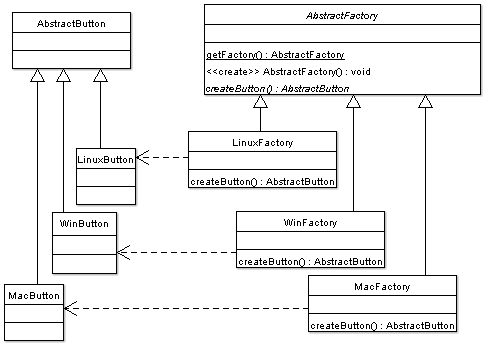

# Summary


## Abstract factory VS factory method

### [What are the differences between Abstract Factory and Factory design patterns?](https://stackoverflow.com/questions/5739611/what-are-the-differences-between-abstract-factory-and-factory-design-patterns)


#### [A](https://stackoverflow.com/a/5740020)

The Difference Between The Two

The main difference between a "factory method" and an "abstract factory" is that the factory method is a single method, and an abstract factory is an **object**. I think a lot of people get these two terms confused, and start using them interchangeably. I remember that I had a hard time finding exactly what the difference was when I learnt them.

Because the factory method is just a **method**, it can be overridden in a subclass, hence the second half of your quote:

> ... the Factory Method pattern uses inheritance and relies on a subclass to handle the desired object instantiation.

The quote assumes that an object is calling *its own* factory method here. Therefore the only thing that could change the return value would be a **subclass**.

The **abstract factory** is an **object** that has multiple **factory methods** on it. Looking at the first half of your quote:

> ... with the Abstract Factory pattern, a class delegates the responsibility of object instantiation to another object via composition ...

What they're saying is that there is an object `A`, who wants to make a `Foo` object. Instead of making the `Foo` object itself (e.g., with a factory method), it's going to get a *different* object (the abstract factory) to create the `Foo` object.

##### Code Examples

To show you the difference, here is a factory method in use:

```java
class A {
    public void doSomething() {
        Foo f = makeFoo();
        f.whatever();   
    }

    protected Foo makeFoo() {
        return new RegularFoo();
    }
}

class B extends A {
    protected Foo makeFoo() {
        //subclass is overriding the factory method 
        //to return something different
        return new SpecialFoo();
    }
}
```

And here is an abstract factory in use:

```java
class A {
    private Factory factory;

    public A(Factory factory) {
        this.factory = factory;
    }

    public void doSomething() {
        //The concrete class of "f" depends on the concrete class
        //of the factory passed into the constructor. If you provide a
        //different factory, you get a different Foo object.
        Foo f = factory.makeFoo();
        f.whatever();
    }
}

interface Factory {
    Foo makeFoo();
    Bar makeBar();
    Aycufcn makeAmbiguousYetCommonlyUsedFakeClassName();
}

//need to make concrete factories that implement the "Factory" interface here
```


#### [A](https://stackoverflow.com/a/5740080)

**Abstract factory** creates a base class with abstract methods defining methods for the objects that should be created. Each factory class which derives the base class can create their own implementation of each object type.



**Factory method** is just a simple method used to create objects in a class. It's usually added in the aggregate root (The `Order` class has a method called `CreateOrderLine`)


##### Abstract factory

In the example below we design an interface so that we can decouple queue creation from a messaging system and can therefore create implementations for different queue systems without having to change the code base.

```JAVA
interface IMessageQueueFactory
{
  IMessageQueue CreateOutboundQueue(string name);
  IMessageQueue CreateReplyQueue(string name);
}

public class AzureServiceBusQueueFactory : IMessageQueueFactory
{
      IMessageQueue CreateOutboundQueue(string name)
      {
           //init queue
           return new AzureMessageQueue(/*....*/);
      }

      IMessageQueue CreateReplyQueue(string name)
      {
           //init response queue
           return new AzureResponseMessageQueue(/*....*/);
      }

}

public class MsmqFactory : IMessageQueueFactory
{
      IMessageQueue CreateOutboundQueue(string name)
      {
           //init queue
           return new MsmqMessageQueue(/*....*/);
      }

      IMessageQueue CreateReplyQueue(string name)
      {
           //init response queue
           return new MsmqResponseMessageQueue(/*....*/);
      }
}
```

##### Factory method

The problem in HTTP servers is that we always need an response for every request.

```JAVA
public interface IHttpRequest
{
    // .. all other methods ..

    IHttpResponse CreateResponse(int httpStatusCode);
}
```

Without the factory method, the HTTP server users (i.e. programmers) would be forced to use implementation specific classes which defeat the purpose of the `IHttpRequest` interface.

Therefore we introduce the factory method so that the creation of the response class also is abstracted away.

##### Summary

The difference is that the **intended purpose** of the class containing a factory method **is not to create objects**, while an abstract factory should only be used to create objects.

One should take care when using factory methods since it's easy to break the LSP ([Liskov Substitution principle](https://stackoverflow.com/questions/4428725/can-you-explain-liskov-substitution-principle-with-a-good-c-example)) when creating objects.


## Summary

无论是abstract factory pattern还是factory method pattern，它们的product都继承自同一个base class。在abstract factory pattern中，factory是一个对象，在factory method pattern中，factory是一个method。

