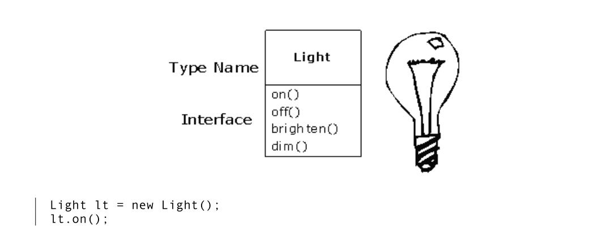

# Introduction to Objects

“We cut nature up, organize it into **concepts**, and ascribe significances as we do, largely because we are parties to an agreement that holds throughout our speech community and is codified in the patterns of
our language … we cannot talk at all except by subscribing to the organization and classification of data which the agreement decrees.” Benjamin Lee Whorf (1897-1941)

> NOTE: 我们之所以将自然分解，组织成各种概念，并按其含义分类，主要是我们是整个口语交流社会共同遵守的协定的参与者，这个协定以语言的形式固定下来...除非赞成这个这个协定中有关语言的组织和分类，否则我们无法交谈。

The genesis of the computer revolution was in a machine. The genesis of our programming languages thus tends to look like that machine.

But computers are not so much machines as they are mind amplification tools (“bicycles for the mind,” as Steve Jobs is fond of saying) and a different kind of **expressive medium**. As a result, the tools are beginning to look less like machines and more like parts of our minds, and also like other forms of **expression** such as writing, painting, sculpture, animation, and filmmaking. **[Object-oriented programming](https://en.wikipedia.org/wiki/Object-oriented_programming)** (OOP) is part of this movement toward using the computer as an **expressive medium**.

This chapter will introduce you to the basic concepts of OOP, including an overview of development methods. 

This chapter is background and supplementary material. Many people do not feel comfortable wading into object-oriented programming without understanding the big picture first. Thus, there are many concepts that are introduced here to give you a solid overview of OOP. However, other people may not get the big picture concepts until they’ve seen some of the mechanics first; these people may become bogged down and lost without some code to get their hands on. If you’re part of this latter group and are eager to get to the specifics of the language, feel free to jump past this chapter—skipping it at this point will not prevent you from writing programs or learning the language. However, you will want to come back here eventually to fill in your knowledge so you can understand why objects are important and how to design with them.

## The progress of abstraction

All programming languages provide **abstractions**. It can be argued that the complexity of the problems you’re able to solve is directly related to the **kind** and **quality** of abstraction. By “kind” I mean, “What is it that you are abstracting?” **Assembly language** is a small abstraction of the underlying machine. Many so-called “imperative” languages that followed (such as FORTRAN, BASIC, and C) were **abstractions** of **assembly language**. These languages are big improvements over assembly language, but their primary abstraction still requires you to think in terms of the structure of the computer rather than the structure of the problem you are trying to solve（也就是说，它们还不够抽象，还是太底层了）. The programmer must establish the association between the machine model (in the “**solution space**,” which is the place where you’re implementing that solution, such as a computer) and the model of the problem that is actually being solved (in the “**problem space**,” which is the place where the problem exists, such as a business). The effort required to perform this mapping, and the fact that it is extrinsic to the programming language, produces programs that are difficult to write and expensive to maintain, and as a side effect created the entire “programming methods” industry.

The alternative to modeling the machine is to model the problem you’re trying to solve. Early languages such as [LISP](https://en.wikipedia.org/wiki/Lisp_(programming_language)) and [APL](https://en.wikipedia.org/wiki/APL_(programming_language)) chose particular views of the world (“All problems are ultimately lists” or “All problems are algorithmic,” respectively). [Prolog](https://en.wikipedia.org/wiki/Prolog) casts all problems into chains of decisions. Languages have been created for constraint-based programming and for programming exclusively by manipulating graphical symbols. (The latter proved to be too restrictive.) Each of these approaches may be a good solution to the particular class of problem they’re designed to solve, but when you step outside of that domain they become awkward.

The object-oriented approach goes a step further by providing tools for the programmer to represent elements in the **problem space**. This representation is general enough that the programmer is not constrained to any particular type of problem. We refer to the **elements** in the **problem space** and their representations in the **solution space** as “**objects**.” (You will also need other **objects** that don’t have problem-space analogs.) The idea is that the program is allowed to adapt itself to the lingo（术语） of the problem by adding new **types** of **objects**, so when you read the code describing the **solution**, you’re reading words that also express the **problem**. This is a more flexible and powerful language abstraction than what we’ve had before. Thus, OOP allows you to describe the problem in terms of the problem, rather than in terms of the computer where the solution will run. There’s still a connection back to the computer: Each object looks quite a bit like a little computer—it has a state, and it has operations that you can ask it to perform. However, this doesn’t seem like such a bad analogy to objects in the real world—they all have characteristics and behaviors.

> NOTE: 关于abstraction，参见文章[Abstraction](https://dengking.github.io/Post/Abstraction/Abstraction/)，其中[Abstraction in programming language](https://dengking.github.io/Post/Abstraction/Abstraction/#abstraction-in-programming-language)章节，讨论了programming language的发展简史。

Alan Kay summarized five basic characteristics of [Smalltalk](https://en.wikipedia.org/wiki/Smalltalk), the first successful object-oriented language and one of the languages upon which [Java](https://en.wikipedia.org/wiki/Java_(programming_language)) is based. These characteristics represent a pure approach to object-oriented programming:

1. **Everything is an [object](https://en.wikipedia.org/wiki/Object_(computer_science))**. Think of an object as a fancy **variable**; it stores data, but you can “make requests” to that object, asking it to perform operations on itself. In theory, you can take any **conceptual component** in the problem you’re trying to solve (dogs, buildings, services, etc.) and represent it as an object in your program.
2. **A program is a bunch of objects telling each other what to do by sending messages. To make a request of an object, you “send a message” to that object**. More concretely, you can think of a message as a request to call a method that belongs to a particular object.
3. **Each object has its own memory made up of other objects**. Put another way, you create a new kind of object by making a package containing existing objects. Thus, you can build complexity into a program while hiding it behind the simplicity of objects.
4. **Every object has a type**. Using the parlance, each object is an ***instance*** of a ***class***, in which “class” is synonymous with “type.” The most important distinguishing characteristic of a class is “What messages can you send to it?”
5. **All objects of a particular type can receive the same messages**. This is actually a loaded statement, as you will see later. Because an object of type “circle” is also an object of type “shape,” a circle is guaranteed to accept shape messages. This means you can write code that talks to shapes and automatically handle anything that fits the description of a shape. This **substitutability** is one of the powerful concepts in OOP.

Booch offers an even more succinct description of an object:

> An object has state, behavior and identity.

This means that an object can have internal data (which gives it state), methods (to produce behavior), and each object can be uniquely distinguished from every other object—to put this in a concrete sense, each object has a unique address in memory. 

> ATTENTION: This is actually a bit restrictive, since objects can conceivably exist in different machines and address spaces, and they can also be stored on disk. In these cases, the identity of the object must be determined by something other than memory address.

## An object has an interface

Aristotle was probably the first to begin a careful study of the concept of type; he spoke of “the class of fishes and the class of birds.” The idea that all objects, while being unique, are also part of a class of objects that have characteristics and behaviors in common was used directly in the first object-oriented language, Simula-67, with its fundamental keyword `class` that introduces a new type into a program.

Simula, as its name implies, was created for developing simulations such as the classic “bank teller problem.” In this, you have numerous tellers, customers, accounts, transactions, and units of money—a lot of “objects.” Objects that are identical except for their state during a program’s execution are grouped together into “classes of objects,” and that’s where the keyword `class` came from. Creating **abstract data types** (classes) is a fundamental concept in **object-oriented programming**. **Abstract data types** work almost exactly like built-in types: You can create variables of a type (called **objects** or **instances** in object-oriented parlance) and manipulate those variables (called **sending messages** or **requests**; you send a message and the object figures out what to do with it). The members (elements) of each class share some commonality: Every account has a balance, every teller can accept a deposit, etc. At the same time, each member has its own state: Each account has a different balance, each teller has a name. Thus, the tellers, customers, accounts, transactions, etc., can each be represented with a unique entity in the computer program. This entity is the object, and each object belongs to a particular class that defines its characteristics and behaviors.

So, although what we really do in object-oriented programming is create new **data types**, virtually all object-oriented programming languages use the “class” keyword. When you see the word “**type**” think “**class**” and vice versa. 

> ATTENTION: Some people make a distinction, stating that type determines the interface while class is a particular implementation of that interface. 

Since a class describes a set of objects that have identical characteristics (data elements) and behaviors (functionality), a class is really a **data type** because a floating point number, for example, also has a set of characteristics and behaviors. The difference is that a programmer defines a class to fit a problem rather than being forced to use an existing data type that was designed to represent a unit of storage in a machine. You extend the programming language by adding new data types specific to your needs. The programming system welcomes the new classes and gives them all the care and type checking that it gives to built-in types.

The object-oriented approach is not limited to building simulations. Whether or not you agree that any program is a simulation of the system you’re designing, the use of OOP techniques can easily reduce a large set of problems to a simple solution.

Once a class is established, you can make as many objects of that class as you like, and then manipulate those objects as if they are the elements that exist in the problem you are trying to solve. Indeed, one of the challenges of object-oriented programming is to create a one-to-one mapping between the elements in the **problem space** and objects in the **solution space**.

But how do you get an object to do useful work for you? There needs to be a way to make a request of the object so that it will do something, such as complete a transaction, draw something on the screen, or turn on a switch. And each object can satisfy only certain requests. The requests you can make of an object are defined by its interface, and the type is what determines the interface. A simple example might be a representation of a light bulb:

The interface determines the requests that you can make for a particular object. However, there must be code somewhere to satisfy that request. This, along with the hidden data, comprises the implementation. From a procedural programming standpoint, it’s not that complicated. A type has a method associated with each possible request, and when you make a particular request to an object, that method is called. This process is usually summarized by saying that you “send a message” (make a request) to an object, and the object figures out what to do with that message (it executes code).

